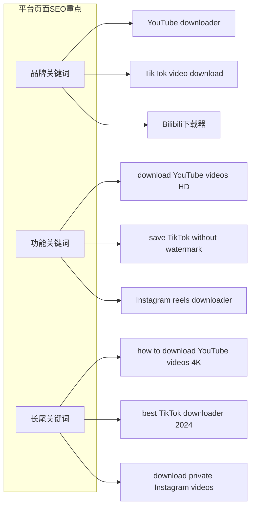
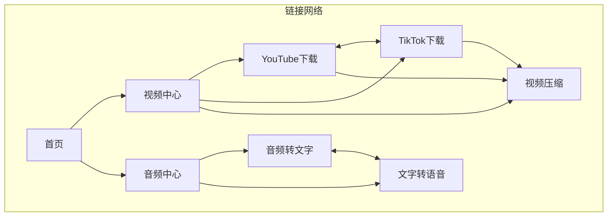
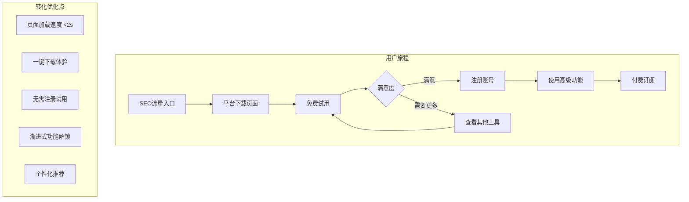

# SparkVideo 重构版SEO架构设计方案

## 一、网站整体架构图（分离音频/视频）

```mermaid
graph TB
    subgraph "主导航架构"
        HOME[首页 /]
        VIDEO[视频工具 /video]
        AUDIO[音频工具 /audio]
        BLOG[博客 /blog]
        PRICING[定价 /pricing]
        ABOUT[关于 /about]
    end
    
    subgraph "视频工具生态 /video"
        subgraph "视频处理工具"
            V1[视频压缩 /video/compress]
            V2[视频转换 /video/convert]
            V3[视频裁剪 /video/crop]
            V4[视频合并 /video/merge]
            V5[视频分割 /video/split]
            V6[视频增强 /video/enhance]
            V7[视频降噪 /video/denoise]
            V8[视频去水印 /video/remove-watermark]
            V9[视频文字识别 /video/extract-text]
        end
        
        subgraph "视频下载平台 /video/download"
            VD[下载中心 /video/download]
            D1[YouTube下载 /video/download/youtube]
            D2[TikTok下载 /video/download/tiktok]
            D3[Instagram下载 /video/download/instagram]
            D4[Facebook下载 /video/download/facebook]
            D5[Twitter下载 /video/download/twitter]
            D6[Bilibili下载 /video/download/bilibili]
            D7[抖音下载 /video/download/douyin]
            D8[快手下载 /video/download/kuaishou]
            D9[小红书下载 /video/download/xiaohongshu]
            D10[微博下载 /video/download/weibo]
            D11[Vimeo下载 /video/download/vimeo]
            D12[Dailymotion下载 /video/download/dailymotion]
            D13[Pinterest下载 /video/download/pinterest]
            D14[Reddit下载 /video/download/reddit]
            D15[Twitch下载 /video/download/twitch]
        end
    end
    
    subgraph "音频工具生态 /audio"
        A1[音频转文字 /audio/transcribe]
        A2[音频翻译 /audio/translate]
        A3[音频格式转换 /audio/convert]
        A4[音频剪辑 /audio/trim]
        A5[音频合并 /audio/merge]
        A6[音频降噪 /audio/denoise]
        A7[音频提取 /audio/extract]
        A8[文字转语音 /audio/text-to-speech]
    end
    
    HOME --> VIDEO
    HOME --> AUDIO
    VIDEO --> V1
    VIDEO --> VD
    VD --> D1
    VD --> D2
    AUDIO --> A1
```



## 二、页面层级结构（SEO优化版）

```
sparkvideo.com/
├── / (首页)
│
├── /video (视频工具中心)
│   ├── /video/compress (视频压缩)
│   ├── /video/convert (视频格式转换)
│   ├── /video/crop (视频裁剪)
│   ├── /video/merge (视频合并)
│   ├── /video/split (视频分割)
│   ├── /video/enhance (视频增强)
│   ├── /video/denoise (视频降噪)
│   ├── /video/remove-watermark (去水印)
│   ├── /video/extract-text (视频文字识别)
│   │
│   └── /video/download (视频下载中心)
│       ├── /video/download/youtube
│       ├── /video/download/tiktok
│       ├── /video/download/instagram
│       ├── /video/download/facebook
│       ├── /video/download/twitter
│       ├── /video/download/bilibili
│       ├── /video/download/douyin
│       ├── /video/download/kuaishou
│       ├── /video/download/xiaohongshu
│       ├── /video/download/weibo
│       ├── /video/download/vimeo
│       ├── /video/download/dailymotion
│       ├── /video/download/pinterest
│       ├── /video/download/reddit
│       └── /video/download/twitch
│
├── /audio (音频工具中心)
│   ├── /audio/transcribe (音频转文字)
│   ├── /audio/translate (音频翻译)
│   ├── /audio/convert (音频格式转换)
│   ├── /audio/trim (音频剪辑)
│   ├── /audio/merge (音频合并)
│   ├── /audio/denoise (音频降噪)
│   ├── /audio/extract (音频提取)
│   └── /audio/text-to-speech (文字转语音)
│
├── /blog (博客系统)
├── /pricing (价格方案)
├── /about (关于我们)
└── /contact (联系我们)
```

## 三、主要页面布局设计

### 1. 首页布局设计

```
┌────────────────────────────────────────────────────┐
│                    Navigation Bar                   │
│  Logo  Video▼  Audio▼  Blog  Pricing  [Login]     │
└────────────────────────────────────────────────────┘

┌────────────────────────────────────────────────────┐
│                    Hero Section                     │
│                                                     │
│     一站式视频音频处理平台                            │
│     All-in-One Video & Audio Processing Platform    │
│                                                     │
│     [开始使用视频工具]  [探索音频工具]                 │
│                                                     │
│     ⟨ 支持15+平台视频下载 | 20+处理工具 ⟩            │
└────────────────────────────────────────────────────┘

┌─────────────────┬─────────────────┬─────────────────┐
│   视频工具 📹    │   音频工具 🎵    │  平台下载 ⬇️    │
├─────────────────┼─────────────────┼─────────────────┤
│  • 视频压缩      │  • 音频转文字     │  • YouTube      │
│  • 视频转换      │  • 音频翻译      │  • TikTok       │
│  • 视频裁剪      │  • 音频剪辑      │  • Instagram    │
│  • 视频合并      │  • 音频降噪      │  • Bilibili     │
│  [查看全部 →]    │  [查看全部 →]    │  [查看全部 →]   │
└─────────────────┴─────────────────┴─────────────────┘

┌────────────────────────────────────────────────────┐
│              特色功能展示 (Features)                 │
├────────────────────────────────────────────────────┤
│  ┌──────────┐  ┌──────────┐  ┌──────────┐         │
│  │ 批量处理  │  │ 高速转换  │  │ 无水印    │         │
│  │          │  │          │  │          │         │
│  │ 一次处理  │  │ GPU加速   │  │ 原画质    │         │
│  │ 多个文件  │  │ 5倍速度   │  │ 下载      │         │
│  └──────────┘  └──────────┘  └──────────┘         │
└────────────────────────────────────────────────────┘

┌────────────────────────────────────────────────────┐
│              使用流程 (How It Works)                │
├────────────────────────────────────────────────────┤
│     1️⃣           2️⃣           3️⃣           4️⃣      │
│   选择工具  →  上传/粘贴  →   处理    →   下载      │
└────────────────────────────────────────────────────┘

┌────────────────────────────────────────────────────┐
│              用户评价 (Testimonials)                │
├────────────────────────────────────────────────────┤
│  ⭐⭐⭐⭐⭐  "最好用的视频工具..."                    │
│  ⭐⭐⭐⭐⭐  "音频转文字超准确..."                    │
└────────────────────────────────────────────────────┘

┌────────────────────────────────────────────────────┐
│                 Footer (多层级)                      │
└────────────────────────────────────────────────────┘
```

### 2. 视频工具中心页面 (/video)

```
┌────────────────────────────────────────────────────┐
│                 视频工具中心                         │
│         Your Complete Video Processing Suite         │
└────────────────────────────────────────────────────┘

┌────────────────────────────────────────────────────┐
│                  工具分类导航                        │
│  [全部] [处理工具] [下载工具] [增强工具] [转换工具]    │
└────────────────────────────────────────────────────┘

┌─────────────────────────┬──────────────────────────┐
│     视频处理工具         │      视频下载平台         │
├─────────────────────────┼──────────────────────────┤
│ ┌─────────────────────┐ │ ┌──────────────────────┐ │
│ │ 🗜️ 视频压缩         │ │ │ 📱 社交媒体平台       │ │
│ │ 减小文件大小90%     │ │ │                      │ │
│ │ [立即使用]          │ │ │ YouTube  TikTok      │ │
│ └─────────────────────┘ │ │ Instagram Facebook   │ │
│                         │ │ Twitter              │ │
│ ┌─────────────────────┐ │ └──────────────────────┘ │
│ │ 🔄 格式转换         │ │                          │
│ │ 支持50+格式        │ │ ┌──────────────────────┐ │
│ │ [立即使用]          │ │ │ 🇨🇳 国内平台          │ │
│ └─────────────────────┘ │ │                      │ │
│                         │ │ Bilibili 抖音        │ │
│ ┌─────────────────────┐ │ │ 快手 小红书 微博      │ │
│ │ ✂️ 视频裁剪         │ │ └──────────────────────┘ │
│ │ 完美比例调整        │ │                          │
│ │ [立即使用]          │ │ ┌──────────────────────┐ │
│ └─────────────────────┘ │ │ 🌍 国际平台          │ │
│                         │ │                      │ │
│ [查看更多工具 →]        │ │ Vimeo Dailymotion    │ │
│                         │ │ Reddit Pinterest     │ │
│                         │ └──────────────────────┘ │
└─────────────────────────┴──────────────────────────┘
```

### 3. 平台下载页面示例 (/video/download/youtube)

```
┌────────────────────────────────────────────────────┐
│              YouTube Video Downloader               │
│         下载YouTube视频 - 免费、快速、高清            │
└────────────────────────────────────────────────────┘

┌────────────────────────────────────────────────────┐
│                  下载工具区域                        │
│ ┌──────────────────────────────────────────────┐   │
│ │ 🔗 粘贴YouTube链接:                          │   │
│ │ [________________________] [下载]            │   │
│ │                                              │   │
│ │ 支持格式: MP4, WebM, 3GP                     │   │
│ │ 支持质量: 144p - 4K                          │   │
│ └──────────────────────────────────────────────┘   │
└────────────────────────────────────────────────────┘

┌────────────────────────────────────────────────────┐
│                  功能特点                           │
├──────────┬──────────┬──────────┬──────────────────┤
│ 🎥 4K画质 │ 🚀 高速  │ 📱 全平台 │ 🔒 安全私密      │
│          │   下载    │   支持    │                 │
└──────────┴──────────┴──────────┴──────────────────┘

┌────────────────────────────────────────────────────┐
│                使用教程 (Tutorial)                  │
├────────────────────────────────────────────────────┤
│  Step 1: 复制YouTube视频链接                        │
│  ┌────────────────────────────────┐                │
│  │ [图片: 复制链接示意]             │                │
│  └────────────────────────────────┘                │
│                                                     │
│  Step 2: 粘贴链接到输入框                           │
│  ┌────────────────────────────────┐                │
│  │ [图片: 粘贴操作示意]             │                │
│  └────────────────────────────────┘                │
│                                                     │
│  Step 3: 选择质量并下载                             │
│  ┌────────────────────────────────┐                │
│  │ [图片: 下载选项示意]             │                │
│  └────────────────────────────────┘                │
└────────────────────────────────────────────────────┘

┌────────────────────────────────────────────────────┐
│               常见问题 FAQ                          │
├────────────────────────────────────────────────────┤
│  Q: 支持下载播放列表吗？                            │
│  A: 是的，支持批量下载整个播放列表                   │
│                                                     │
│  Q: 下载的视频有水印吗？                            │
│  A: 没有，我们提供无水印原画质下载                   │
│                                                     │
│  Q: 支持下载YouTube Shorts吗？                      │
│  A: 支持，可以下载所有类型的YouTube视频              │
└────────────────────────────────────────────────────┘

┌────────────────────────────────────────────────────┐
│              相关工具推荐                           │
├─────────┬─────────┬─────────┬──────────────────────┤
│ TikTok  │Instagram│ Bilibili│ 视频转换器           │
│ 下载器  │ 下载器  │ 下载器  │                      │
└─────────┴─────────┴─────────┴──────────────────────┘
```

### 4. 音频工具中心页面 (/audio)

```
┌────────────────────────────────────────────────────┐
│                 音频工具中心                         │
│          Professional Audio Processing Tools         │
└────────────────────────────────────────────────────┘

┌────────────────────────────────────────────────────┐
│                  核心工具展示                        │
├────────────────────────────────────────────────────┤
│  ┌───────────────┐  ┌───────────────┐             │
│  │ 🎤 音频转文字  │  │ 🌍 音频翻译   │             │
│  │               │  │               │             │
│  │ AI精准识别    │  │ 100+语言     │             │
│  │ 准确率99%     │  │ 实时翻译     │             │
│  │               │  │               │             │
│  │ [开始转写]    │  │ [开始翻译]    │             │
│  └───────────────┘  └───────────────┘             │
│                                                     │
│  ┌───────────────┐  ┌───────────────┐             │
│  │ 🔊 格式转换   │  │ ✂️ 音频剪辑   │             │
│  │               │  │               │             │
│  │ MP3/WAV/FLAC  │  │ 精确到毫秒   │             │
│  │ 无损转换      │  │ 多轨道编辑   │             │
│  │               │  │               │             │
│  │ [选择文件]    │  │ [开始剪辑]    │             │
│  └───────────────┘  └───────────────┘             │
└────────────────────────────────────────────────────┘

┌────────────────────────────────────────────────────┐
│                  高级功能                           │
├──────────────┬──────────────┬──────────────────────┤
│ 🎵 音频降噪   │ 🎙️ 音频提取  │ 💬 文字转语音        │
│ AI智能降噪   │ 从视频提取   │ 自然人声合成         │
└──────────────┴──────────────┴──────────────────────┘
```

### 5. 移动端响应式设计

```
手机端布局 (375px)
┌─────────────────┐
│   ☰  Logo  🔍   │
├─────────────────┤
│                 │
│   Hero区域      │
│   简洁标题      │
│                 │
│ [视频] [音频]   │
├─────────────────┤
│ 热门工具        │
├─────────────────┤
│ □ YouTube下载   │
│ □ 视频压缩      │
│ □ 音频转文字    │
│ □ TikTok下载    │
├─────────────────┤
│ 查看所有工具 →  │
└─────────────────┘

平板端布局 (768px)
┌───────────────────────┐
│    Logo  Nav  Login   │
├───────────────────────┤
│      Hero Section     │
├──────────┬────────────┤
│ 视频工具  │ 音频工具   │
├──────────┼────────────┤
│ 工具列表  │ 工具列表   │
└──────────┴────────────┘
```

## 四、SEO优化策略（针对新架构）

### 1. 平台页面SEO策略



### 2. 内部链接策略



### 3. 每个平台页面的Meta标签策略

```html
<!-- YouTube下载页面 -->
<title>YouTube Video Downloader - Free HD/4K Download | SparkVideo</title>
<meta name="description" content="Download YouTube videos in HD, 4K quality for free. No watermark, fast speed, support playlist download. Best YouTube downloader 2024.">
<meta name="keywords" content="youtube downloader, youtube video download, 4k youtube download, youtube to mp4">

<!-- TikTok下载页面 -->
<title>TikTok Video Downloader - No Watermark | SparkVideo</title>
<meta name="description" content="Download TikTok videos without watermark in HD quality. Save TikTok videos to MP4, support batch download.">

<!-- Bilibili下载页面 -->
<title>Bilibili视频下载器 - B站视频解析下载 | SparkVideo</title>
<meta name="description" content="免费下载B站视频，支持1080P、4K画质，批量下载番剧、UP主视频，无需登录。">
```

## 五、视频下载中心交互设计

### 1. 左侧导航交互

```javascript
// 平台导航数据结构
const platformCategories = [
  {
    id: 'popular',
    name: '🔥 热门平台',
    platforms: [
      { id: 'youtube', name: 'YouTube', icon: '📺', active: true },
      { id: 'tiktok', name: 'TikTok', icon: '🎵' },
      { id: 'instagram', name: 'Instagram', icon: '📷' },
      { id: 'facebook', name: 'Facebook', icon: '👥' }
    ]
  },
  {
    id: 'china',
    name: '🇨🇳 国内平台',
    platforms: [
      { id: 'bilibili', name: 'Bilibili', icon: '📺' },
      { id: 'douyin', name: '抖音', icon: '🎭' },
      { id: 'kuaishou', name: '快手', icon: '📹' },
      { id: 'xiaohongshu', name: '小红书', icon: '📝' },
      { id: 'weibo', name: '微博', icon: '🌟' }
    ]
  },
  {
    id: 'international',
    name: '🌍 国际平台',
    platforms: [
      { id: 'vimeo', name: 'Vimeo', icon: '🎬' },
      { id: 'dailymotion', name: 'Dailymotion', icon: '📺' },
      { id: 'pinterest', name: 'Pinterest', icon: '📌' },
      { id: 'reddit', name: 'Reddit', icon: '👽' },
      { id: 'twitch', name: 'Twitch', icon: '🎮' }
    ]
  }
]

// 交互状态管理
const [selectedPlatform, setSelectedPlatform] = useState('youtube')
const [isAnalyzing, setIsAnalyzing] = useState(false)
const [videoInfo, setVideoInfo] = useState(null)
```

### 2. 视频解析交互流程

```typescript
// 视频解析流程
interface VideoAnalysisFlow {
  // Step 1: 用户输入URL
  inputURL: (url: string) => void
  
  // Step 2: 验证URL格式
  validateURL: (url: string) => boolean
  
  // Step 3: 识别平台
  detectPlatform: (url: string) => Platform
  
  // Step 4: 调用API解析
  analyzeVideo: async (url: string) => VideoInfo
  
  // Step 5: 展示结果
  displayResults: (info: VideoInfo) => void
  
  // Step 6: 用户选择质量下载
  downloadVideo: (quality: Quality) => void
}

// 实时状态反馈
const AnalysisStates = {
  IDLE: '请粘贴视频链接',
  VALIDATING: '验证链接中...',
  ANALYZING: '正在解析视频信息...',
  SUCCESS: '解析成功，请选择下载质量',
  ERROR: '解析失败，请检查链接是否正确'
}
```

### 3. 动态加载效果

```css
/* 左侧导航切换动画 */
.platform-nav-item {
  transition: all 0.3s ease;
  cursor: pointer;
}

.platform-nav-item:hover {
  background: rgba(99, 102, 241, 0.1);
  transform: translateX(4px);
}

.platform-nav-item.active {
  background: linear-gradient(90deg, rgba(99, 102, 241, 0.15) 0%, transparent 100%);
  border-left: 3px solid #6366F1;
}

/* 内容切换动画 */
@keyframes fadeInUp {
  from {
    opacity: 0;
    transform: translateY(10px);
  }
  to {
    opacity: 1;
    transform: translateY(0);
  }
}

.content-area {
  animation: fadeInUp 0.4s ease;
}

/* 解析进度动画 */
.analyzing-pulse {
  animation: pulse 1.5s infinite;
}

@keyframes pulse {
  0%, 100% { opacity: 1; }
  50% { opacity: 0.5; }
}
```

### 4. 实时交互反馈

```typescript
// 粘贴板自动检测
useEffect(() => {
  const detectClipboard = async () => {
    const text = await navigator.clipboard.readText()
    if (isValidVideoURL(text)) {
      setInputURL(text)
      showToast('检测到视频链接，已自动填充')
    }
  }
  detectClipboard()
}, [selectedPlatform])

// 拖拽URL支持
const handleDrop = (e: DragEvent) => {
  e.preventDefault()
  const url = e.dataTransfer.getData('text')
  if (isValidVideoURL(url)) {
    setInputURL(url)
    analyzeVideo(url)
  }
}

// 键盘快捷键
useKeyboardShortcuts({
  'cmd+v': () => pasteAndAnalyze(),
  'enter': () => startAnalysis(),
  'cmd+d': () => downloadSelected()
})
```

## 六、技术实现要点

### 1. 路由配置 (Next.js App Router)

```typescript
// app目录结构
app/
├── (marketing)/
│   ├── page.tsx                    // 首页
│   ├── video/
│   │   ├── page.tsx                // 视频工具中心
│   │   ├── compress/page.tsx       // 视频压缩
│   │   ├── convert/page.tsx        // 视频转换
│   │   └── download/
│   │       ├── page.tsx            // 下载中心
│   │       ├── youtube/page.tsx    // YouTube下载
│   │       ├── tiktok/page.tsx     // TikTok下载
│   │       └── [platform]/page.tsx // 动态平台页面
│   │
│   ├── audio/
│   │   ├── page.tsx                // 音频工具中心
│   │   ├── transcribe/page.tsx     // 音频转文字
│   │   └── translate/page.tsx      // 音频翻译
│   │
│   └── blog/
│       ├── page.tsx
│       └── [slug]/page.tsx
│
├── (app)/                          // 需要认证的应用
│   ├── dashboard/page.tsx
│   └── settings/page.tsx
│
└── (auth)/
    ├── login/page.tsx
    └── register/page.tsx
```

### 2. 平台配置管理

```typescript
// config/platforms.ts
export const VIDEO_PLATFORMS = {
  youtube: {
    name: 'YouTube',
    slug: 'youtube',
    domain: 'youtube.com',
    logo: '/logos/youtube.svg',
    features: ['4K', 'Playlist', 'Subtitles'],
    keywords: ['youtube downloader', 'youtube to mp4'],
    description: 'Download YouTube videos in HD/4K quality'
  },
  tiktok: {
    name: 'TikTok',
    slug: 'tiktok',
    domain: 'tiktok.com',
    logo: '/logos/tiktok.svg',
    features: ['No Watermark', 'HD Quality'],
    keywords: ['tiktok downloader', 'save tiktok video'],
    description: 'Download TikTok videos without watermark'
  },
  bilibili: {
    name: 'Bilibili',
    slug: 'bilibili',
    domain: 'bilibili.com',
    logo: '/logos/bilibili.svg',
    features: ['1080P', '4K', '番剧下载'],
    keywords: ['B站下载', 'bilibili下载器'],
    description: 'B站视频下载，支持高清画质'
  }
  // ... 其他平台配置
}
```

### 3. SEO组件封装

```typescript
// components/SEO/PlatformSEO.tsx
export function PlatformSEO({ platform }: { platform: Platform }) {
  return (
    <>
      <title>{platform.seoTitle}</title>
      <meta name="description" content={platform.seoDescription} />
      <meta name="keywords" content={platform.keywords.join(', ')} />
      
      {/* Open Graph */}
      <meta property="og:title" content={platform.seoTitle} />
      <meta property="og:description" content={platform.seoDescription} />
      <meta property="og:image" content={platform.ogImage} />
      
      {/* 结构化数据 */}
      <script type="application/ld+json">
        {JSON.stringify({
          "@context": "https://schema.org",
          "@type": "SoftwareApplication",
          "name": `${platform.name} Downloader`,
          "applicationCategory": "MultimediaApplication",
          "offers": {
            "@type": "Offer",
            "price": "0",
            "priceCurrency": "USD"
          }
        })}
      </script>
    </>
  )
}
```

## 六、营销漏斗设计



## 七、监控指标

### 1. SEO指标
- 各平台页面排名追踪
- 长尾关键词覆盖率
- 页面索引状态
- Core Web Vitals分数

### 2. 用户行为指标
- 平台页面跳出率
- 工具使用转化率
- 注册转化率
- 付费转化率

### 3. 技术指标
- 页面加载时间
- API响应时间
- 下载成功率
- 错误率监控

这个重构的架构充分考虑了：
1. **SEO最大化**: 每个平台独立页面，精准定位关键词
2. **用户体验**: 清晰的导航结构，视频/音频分离
3. **商业价值**: 免费试用到付费的转化路径
4. **技术可行性**: 模块化设计，易于扩展新平台